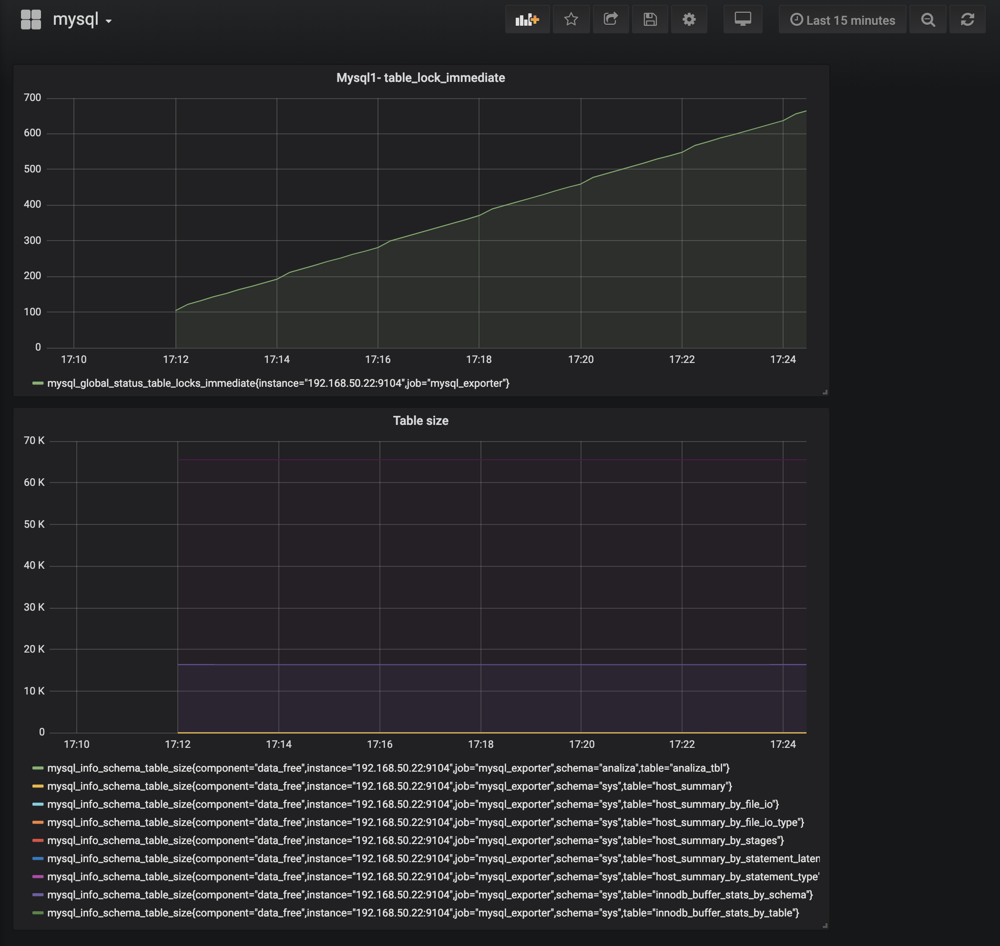

Access to Grafana WEB GUI:

| Username | Password | Port |
|----------|----------|------|
| admin    | admin    | 3000 |

**Target configuration:**

The environment consists of 5 virtual machines:

- 3 servers with installed:  Prometheus, Grafana-Server, Node_exporter
- 2 servers with installed: MySQL server, Mysql_exporter

Infrastructure diagram: 


***
**Components:**

DataCenter1:

* Prometheus1-[192.168.50.21],  Mysql1-[192.168.50.22], Grafana-[192.168.50.21]

DataCenter2:

* Prometheus2-[192.168.50.23],  Mysql2-[192.168.50.24], Grafana-[192.168.50.23]

DataCenter: Global:

* Prometheus3-[192.168.50.25], Grafana-[192.168.50.25]

***

```
**Data Flow:**

The Prometheus1 and Prometheus2 servers scrapes targets
from Mysql1/2 - in that case ALL MYSQL metrics (exported by msql_exporter - port 9104).

Prometheus3 (Global Datacenter) scrape selected time series (job: mysql_exporter) from Prometheus1/2servers. 
IMPORTANT: Prometheus3 collects only SELECTED METRICS - in this case MYSQL. The rest - like Prometheus, Node are not downloaded). 
This is Hierarchical federation which allows Prometheus to scale to environments with tens of data centers and millions of nodes. In this use case, the federation topology resembles a tree, with higher-level Prometheus servers collecting aggregated time series data from a larger number of subordinated servers.

**Example in practice:**

Below is a drawing showing mysql dashboard (grafan server - data from prometheus1: 192.168.50.3000)



and now - dashboard Global-mysql from prometheus3 (Grtafana: 192.168.50.25:3000) which presents SPECIFIC, SELECTED metrics from both servers - in this case, to compare the size of the ANALIZA table


Author and more detail show of this page https://itandrehoch.github.io/Prometheus-federation/

        

          


